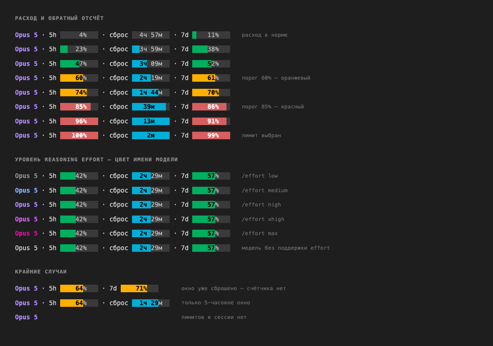

# claude_monitor

Мониторинг лимитов Claude: виджет в строке меню и строка статуса внутри Claude Code.

## Установка

```bash
git clone https://github.com/ivan-moskvin/claude_monitor.git
cd claude_monitor
```

Нужны `go`, `node` и `rust`; чего не хватает — скрипт запуска назовёт и подскажет команду.

## Запуск

macOS:

```bash
./run.sh
```

Windows:

```powershell
.\run.ps1
```

Скрипт соберёт всё из исходников и запустит виджет. Приложение живёт прямо в клоне
репозитория — в систему ничего не ставится, подписывать и разрешать нечего.

Дальше всё из попапа: автозапуск и установка строки статуса.

Обновиться — `git pull` и снова запустить скрипт: он пересоберёт и перезапустит виджет.
Остановить — `pkill -x claude-usage-bar`, в Windows `Stop-Process -Name claude-usage-bar`.

Автозапуск и строка статуса ссылаются на бинарь в клоне, поэтому репозиторий
лучше не переносить — после переезда достаточно запустить скрипт заново.

## Виджет

Кольцо в строке меню — 5-часовое окно: зелёное до 60%, оранжевое до 85%, дальше красное.
В попапе — оба окна, время до сброса и проценты.

Цифры растут только пока запущена сессия Claude Code. Без сессий виджет показывает
последнее известное значение с пометкой о его возрасте, а уже сброшенное окно гасит.

## Строка статуса

```
Opus 5 · 5h ▕   24%    ▏ · сброс ▕  2ч 45м  ▏ · 7d ▕   57%    ▏
```

Цвет полос — по расходу, цвет модели — по текущему уровню `/effort`:



## Как это работает

Лимиты приходят от самого Claude Code: строка статуса печатает их и складывает в
`~/.claude/usage-snapshot.json`, виджет читает этот файл. Никаких сетевых запросов,
токенов и обращений к Keychain. Формат — в [docs/PROTOCOL.md](docs/PROTOCOL.md).

Исходники открыты, чтобы это можно было проверить.
