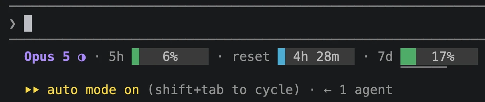
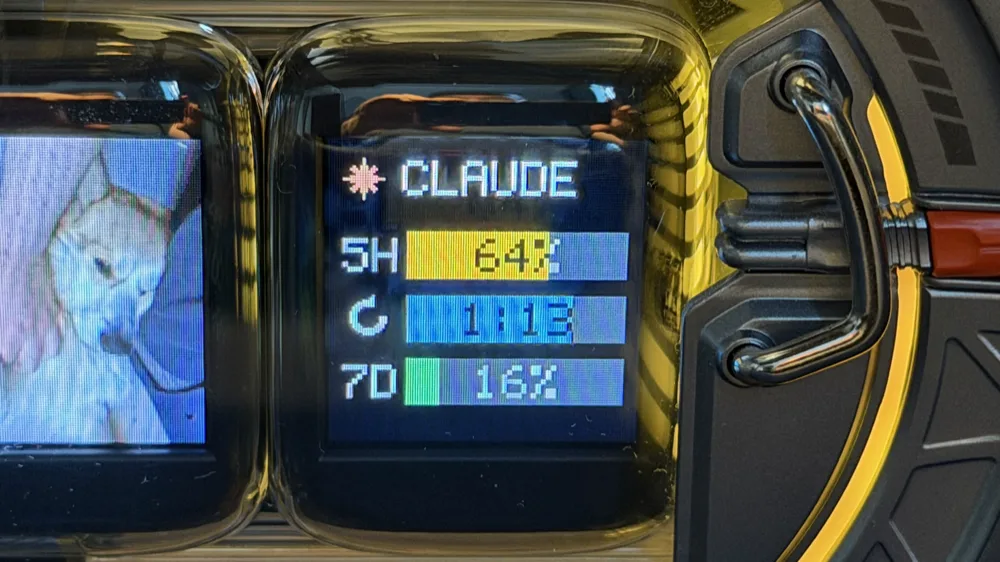

# claude_monitor


Claude limits in the Claude Code status line — visible while you work, without `/usage`.



## Install

macOS and Linux:

```bash
curl -fsSL https://raw.githubusercontent.com/ivan-moskvin/claude_monitor/main/install.sh | sh
```

Windows (PowerShell):

```powershell
irm https://raw.githubusercontent.com/ivan-moskvin/claude_monitor/main/install.ps1 | iex
```

## Update

```bash
claudestatus update
```

Turn the check off: `CLAUDESTATUS_NO_AUTO_UPDATE=1`.

## Uninstall

```bash
claudestatus uninstall
```

Removes the status line from the settings, the cache, the Divoom panel and the binary itself.

## Commands

```
claudestatus            status line: session JSON on stdin, line on stdout
claudestatus check      check whether a new version is out
claudestatus update     download the latest version and replace itself with it
claudestatus uninstall  remove the status line, the cache and the binary
claudestatus divoom     show the limits on a Divoom Times Gate screen
claudestatus version    print the version
```

## The status line

The model, the current `/effort` level, the five-hour window, the time until it
resets and the weekly window. The circle next to the model fills up from `low`
(`○`) to `max` (`●`). The color of the bars follows usage: green up to 60%,
orange up to 85%, red above.

## Language

English by default, Russian on a Russian system. The language is taken from
`LC_ALL` / `LC_MESSAGES` / `LANG` (on Windows, from the user interface language)
and can be forced:

```bash
CLAUDESTATUS_LANG=en   # or ru
```

## Completion

```bash
claudestatus completion zsh >> ~/.zshrc    # or bash >> ~/.bashrc
```

## Divoom Times Gate

The same limits — on the screen of a [Divoom Times Gate](https://divoom.com/products/time-gate).



```bash
claudestatus divoom on
```

Finds the device on the network and turns the panel on. From there it updates
itself while a session is running. Turn it off with `claudestatus divoom off`.

It takes the fifth screen, which can be changed to any other:

```bash
claudestatus divoom screen 3
```
The device draws the panel by downloading a frame, so on every update the screen
blinks its loading indicator. The details of the protocol are in
[divoom/README.md](divoom/README.md).

## Security

The limits come from Claude Code itself: it feeds the session JSON to the
statusline command on stdin, and that is where the numbers are taken from. No
requests to the Anthropic API, no tokens, no Keychain access — your keys and
your conversations are out of reach for this utility. The numbers are refreshed
only while a session is running.

Two requests go outside, and neither is about you:

- to GitHub — to learn the version of the latest release and download the binary;
- to the Divoom device directory — to ask for the address of your Times Gate on
  the local network. The directory answers by shared public IP and returns the
  address and the model only.

No mail, no passwords, no tokens. Beyond that the bridge works without the
internet: the panel travels to the Times Gate over a local address, and the only
picture handed to it is the one you see on the screen. Nothing but the device
itself can fetch it.
